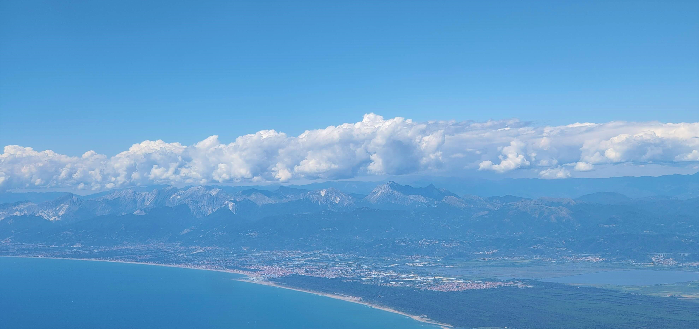

```{r, out.width = "100%", out.height= "60%",echo = FALSE, fig.align='center'}

```

# Welcome!
You have reached the personal webpage of Camila Pacheco-Riaño.
I am global change ecologist and  biogeographer currently studying biodiversity lag responses to climate change at the [University of Bergen](https://www.uib.no/en/bio). The underlying aim of my research is to determine what are the sources of the complex patterns of biodiversity change observed over time around the mountains of world.

[Read more about me..](about.html)

This website is under construction.